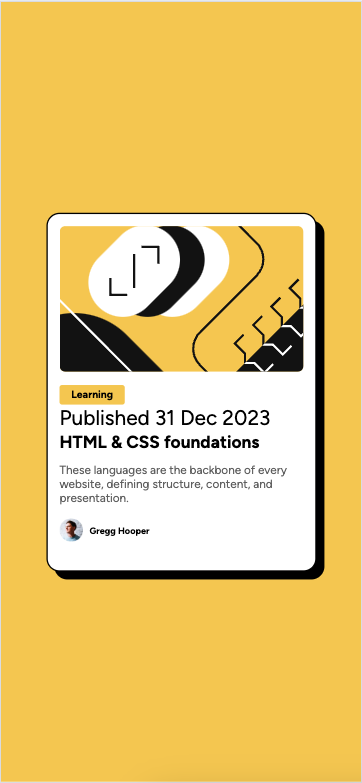
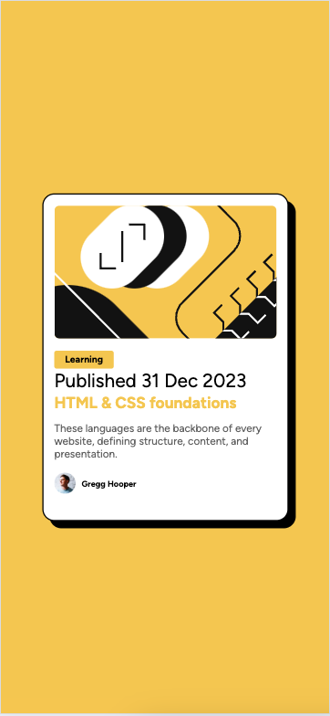

# Frontend Mentor - Blog preview card solution

This is a solution to the [Blog preview card challenge on Frontend Mentor](https://www.frontendmentor.io/challenges/blog-preview-card-ckPaj01IcS). Frontend Mentor challenges help you improve your coding skills by building realistic projects. 

## Table of contents

- [Overview](#overview)
  - [The challenge](#the-challenge)
  - [Screenshot](#screenshot)
  - [Links](#links)
- [My process](#my-process)
  - [Built with](#built-with)
  - [What I learned](#what-i-learned)
  - [Continued development](#continued-development)
  - [Useful resources](#useful-resources)
- [Author](#author)
- [Acknowledgments](#acknowledgments)

**Note: Delete this note and update the table of contents based on what sections you keep.**

## Overview

### The challenge

Users should be able to:

- See hover and focus states for all interactive elements on the page

### Web Version:

Normal State:

Hovered State:

### Mobile version

Normal State:

Hovered State:

### Links

- Solution URL: [Add solution URL here](https://your-solution-url.com)
- Live Site URL: [Add live site URL here](https://your-live-site-url.com)

## My process

### Built with

- Semantic HTML5 markup
- CSS custom properties
- Flexbox

### What I learned

I learnt stuff from the last lesson, especially breaking down my code better. Going step by step is very important, atleast at this stage. So I made the background div and perfected that, then moved to the card, then to the image and finally to the text and name credit bit. I found it easier to solve problem this way. Also i learnt about shadow, which was very cool 

## Author

- Website - [Rishant](https://www.rishantgodara.com)
- Frontend Mentor - [@RishantGod](https://www.frontendmentor.io/profile/RishantGod)

